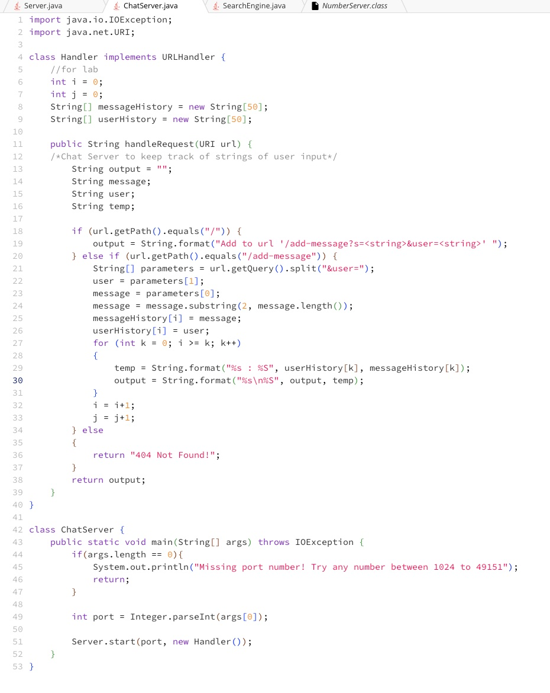
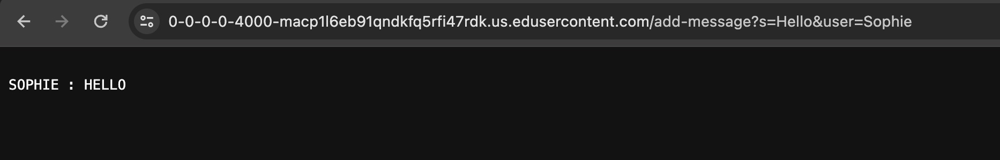
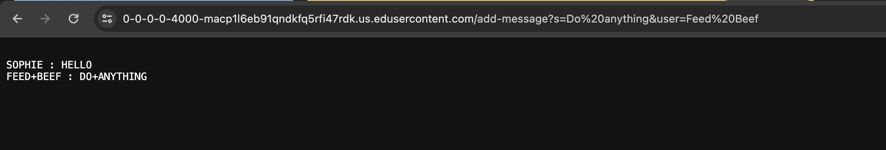
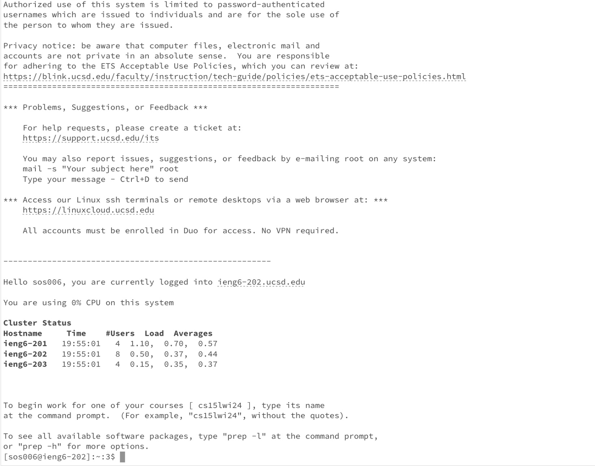
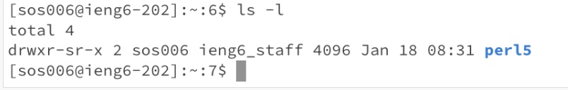
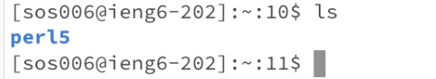

# WEEK 1 Lab Report

## Introduction
The goal of this week's lab is introducing Edstem and setting up a Workspace, which comes with the file system and a terminal to practice command lines and simple commands. During this week's labs, we practiced with cd, ls, and cat. Below are some of the commands we worked with.

## cd  


**Share an example of using the command with no arguments**
```
[user@sahara ~]$ cd lecture1/messages/
[user@sahara ~/lecture1/messages]$ cd
[user@sahara ~]$ pwd
/home
```
- using the cd command was run in the `messages` working directory
- the cd with no argument moves to `home`  directory from previous (`messages`) directory
- this is shown in the next line that we are in `home` directory because there are no other directory names
  
**Share an example of using the command with a path to a directory as an argument**
```
[user@sahara ~]$ cd lecture1
[user@sahara ~/lecture1]$ 
```
- working directory command was run in the `home` directory
- `cd` command changes the current directory to a specific directory given by the name listed next to the `cd` command
- The output on the next line was lecture1 next to the `~`, which means that `lecture1` became the working directory which is the correct output.

**Share an example of using the command with a path to a file as an argument**
```
[user@sahara ~/lecture1]$ cd lecture1/Hello.class
bash: cd: lecture1/Hello.class: No such file or directory
[user@sahara ~/lecture1]$ 
```
- working directory command was run in `home` directory
- this is output because `Hello.class` is not a directory so it cannot be accessed by `cd` command
- the output above is an error because we are not `Hello.class` directory, and did not output as intended
  

## ls 
**Share an example of using the command with no arguments**
```
[user@sahara ~/lecture1]$ ls
Hello.class  Hello.java  messages  README
[user@sahara ~/lecture1]$
```
- working directory: `lecture1` directory where `ls` command was run in
- `ls` command lists the content of the current working directory
- this output is correct since these are the files and directories within `lecture1` directory

**Share an example of using the command with a path to a directory as an argument**
```
[user@sahara ~]$ ls lecture1/messages/
en-us.txt  es-mx.txt  zh-cn.txt
[user@sahara ~]$ 
```
- `ls` command was run in `home` directory
- this output is shown because path written led to `messages` directory and listed content within `messages` directory
- it is the correct output because this is the right content in the `messages` directory

**Share an example of using the command with a path to a file as an argument**
```
[user@sahara ~]$ ls lecture1/messages/en-us.txt 
lecture1/messages/en-us.txt
[user@sahara ~]$ 
```
- working directory the command run in:  `home`
- `ls` command lists contents of a directory
- in this case it is used for a file
- the ouput is not an error since `ls` is working as intended to
  

## cat
**Share an example of using the command with no arguments**
```
[user@sahara ~]$ cat
im using this command with no arguments 
im using this command with no arguments 
i will type control d to end
i will type control d to end
[user@sahara ~]$ 
```
- working directory where command was run in: `home`
- when `cat` is used with no arguments it waits for input from user and displays what user inputs until user types `control D`
- output is correct until user types `control D`


**Share an example of using the command with a path to a directory as an argument**
```
[user@sahara ~]$ cat lecture1/messages/
cat: lecture1/messages/: Is a directory
[user@sahara ~]$ 
```
- working directory where command was run in: `home`
- output is shown because path was written to `messages` directory
- `cat` is used to access contents in a file
- output is an error because `cat` accesses the contetns in a file not in a directory such as `messages`

**Share an example of using the command with a path to a file as an argument**
```
[user@sahara ~]$ cat lecture1/README
To use this program:

javac Hello.java
java Hello messages/en-us.txt
```
- working directory where the command was run in: `home`
- `cat` command shows contents that are within file passed in the argument
- output is correct because the contents listed match the contents in the file when opened


</br>

</br>

</br>


# WEEK 3 LAB REPORT

## PART 1
**Writing a web server**

In part 1, I wrote a piece of code called ChatServer. The goal of ChatServer is to keep track of a single string that gets added to by incoming requests.



Here is the code for ChatServer

**Example 1**
</br>
 In this example we are using the piece of code `Add to url '/add-message?s=<string>&user=<string>` to add a message from a user
 </br>

</br>
- method code calls: `public String handleRequest(URI url)` and `public static void main(String[] args) throws IOException`
  - in these methods the arguments are passed through and calls on the class
  - the string argument inputs get passed through the `if else if else` statement to add message
  - it will also keep track of this first input message and will add to it since `k` value is being incremented so it will add and keep track of string from     
     previous string input
  - for second method it calls the other one to check port number to see if it is in range
- relevant arguments:
  - string inputs: `Sophie`, `Hello`, `Feed Beef`
  - port inputs(command line): `4000`
- relevant fields of the class:
  - string variables:
  ```
  String output = "";
  String message;
  String user;
  String temp;
  ```
  - int variables:
  ```
  int i = 0;
  int j = 0;
  ```
- things I noticed from values in fields:
  - first iteration of `if else if else` statement in `public String handleRequest(URI url)`
  - changes null string variables of `messageHistory` and `userHistory` and replaces it with first string input from the user in web server
  
</br>

**Example 2**

</br>



- method code calls: `public String handleRequest(URI url)` and `public static void main(String[] args) throws IOException`
  - in these methods the arguments are passed through and calls on the class
  - the string argument inputs get passed through the `if else if else` statement to add message
  - it will also keep track of this first input message and will add to it since `k` value is being incremented so it will add and keep track of string from     
     previous string input
  - for second method it calls the other one to check port number to see if it is in range
- relevant arguments:
  - string inputs: `Sophie`, `Hello`, `Feed Beef`
  - port inputs(command line): `4000`
- relevant fields of the class:
  - string variables:
  ```
  String output = "";
  String message;
  String user;
  String temp;
  ```
  - int variables:
  ```
  int i = 0;
  int j = 0;
  ```
- things I noticed:
  - after the first iteration through `if else if else` statement (shown in example 1) the value that changed was `userHistory` because it goes through and gets 
    incremented to show the output in pic above (example 2)
  - `messageHistory` also changes to keep track of old string and this is done in the `if else if else` statement in method `public String handleRequest(URI url)`
  - iterates through `if else if` for a second time

## PART 2

**Using SSH key for logging into ieng on computer**

- logging into ieng without being asked for the password:



- this is the correct output because it shows that I am logging into the instititution with my ieng account

- absolute path of public key:



- absolute path of private key:




## PART 3

**Reflection**

During this weeks lab, I thought setting up vscode and connecting to github went smoothly for me. However, part 2, was difficult for me and I honestly did not understand the instructions nor how to set up the key in local. I had some difficulties there, hence being asked for my password again. I will keep practicing with the material in part 2. 

 


