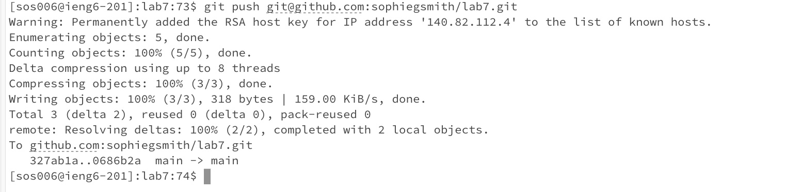

# LAB REPORT 4

## Introduction

In this week's lab, we worked on key board commands and getting comfortable with how to use vim to edit files. In this lab, we had to fork this repository, create an ssh key, and then edit the files using vim.

**Log into ieng6**

keys pressed: `<up><up><up><up><up><up><up><up><up><up><up><up><up><up><up><up><up><up><enter>` I had to use the up arrow key 18 times to get to the command `ssh` command to login. The command was 18 up in the search history for me to access it. Since I logged in this morning, to access my ssh in ucsd, it remembered and allowed me to login and access it.

**Fork the Repository**

keys pressed: To access the `cat /home/linux/ieng6/oce/3m/sos006/.ssh/id_rsa.pub` `<up><up><up><up><up><up><up><up><up><up><up><up><up><enter>` I had to use the arrow up key 14 times to access it in the bash history. This was the way to access it for me. 

edit: to address this comment from my gradescope, I went to check if this repository cloned properly and it did since it is existing in my directory. keys pressed: `git clone <ssh>`. Since not in my history, I had to type the command itself. 

  
**Show the test failure**

keys pressed: To access the `javac -cp .:lib/hamcrest-core-1.3.jar:lib/junit-4.13.2.jar *.java` `<up><up><up><up><up><up><up><up><up><up><up><enter>` I had to use the up arrow key 11 times to access this command in my bash history to show that the tests failed. Similarily with the `java -cp .:lib/hamcrest-core-1.3.jar:lib/junit-4.13.2.jar org.junit.runner.JUnitCore ListExamplesTests`, I had to press `<up><up><up><up><up><up><up><up><up><up><enter>`. This gives the test failure as show above. 

**Edit code file**

keys pressed: To access the `vim ListExamples.java` in my history I had to press the keys `<up><up><up><up><up><Enter>` since it was sitting 6 lines up in my hitory. Now to access the file itself, I had to use `<i>` to go into the vim insert mode. Then, I had to use the key `<j>` about 20 times to move down to the line where it says `change index1 to index2`. After I used key `<l>` about 5 times to move the cursor until I hit the 1 after index. I then pressed `<delete>` and typed `2`. After, I pressed `<ESC>` to exit out of insert mode and into normal mode. Then, I used the command `:wq` to save and quit my work.

**Show the test succeeds**

keys pressed: To acces the `javac -cp .:lib/hamcrest-core-1.3.jar:lib/junit-4.13.2.jar *.java`, i had to press `<up><up><up><up><up><enter>` since this command was about 5 lines up so I had to up arrow 5 times to access it. For the command `java -cp .:lib/hamcrest-core-1.3.jar:lib/junit-4.13.2.jar org.junit.runner.JUnitCore ListExamplesTests` I had to press `<up><up><up><enter>` since the command was 4 lines up so I had to use the up arrow key command 5 times to access it. After these two commands we got the output shown above. 

**Commit and Push the Results**

keys pressed: To access my commit message: `git commit -m "changed index1 to index2"`, I had to press `<up><up><up><enter>` since this line was 3 up, and this was how I accessed this command. After, I had to press `<up><up><enter>` to access my `git add ListExamples.java`. Finally, to push my work into github I just had to use `<up><enter>` to acces my `git push`. This is where my commands were sitting in the history. 

edit: Since my repository did clone properly I was able to use the command `git init` to see if it would push to the right repository. Shown in pics above. keys pressed: `git init`, `git add .`, `git status`, and the following commands shown in the images above. Since it was not sitting in my history I had to use the actual commands themselves, and `<up><down>` for the message in `lab4redopic1`

We observe that it succesfully pushed into the repository with the commit message. 

## Conclusion

In my opinion, I think the purpose of this lab was to hone in our keyboard skills and try to shorten the amount of time it takes to edit and run steps. Additionally, it felt like the goal of this lab was to practice and become more fluent with using keys such as <tab> <up> <down> and improve the speed of our workflow. In sections **Fork the repository** and **Commit and Push the Results** I address the comments from gradescope and provide the following edits.

