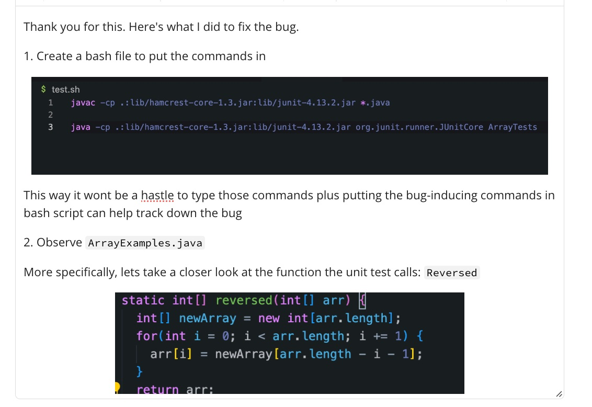

# LAB REPORT 5

## Part 1

If I needed help with debugging something in the code. Here's how *I* would ask the question:

If *I* were a TA, here's how I imagine how I would reply:

Again, in this scenario, this would be my response to the TA:

Finally, here's how I would reply to a student if they needed help.

## Part 2 - Reflection

I would say the most interesting thing I learned in the labs is vim. For some reason I liked it and thought it was fun to do. During the lab where we did the vim tutorials, I found it fun because it felt like those typing practice websites. Additionally, the last few labs and skill demo we did were fun because we were using vim. 
