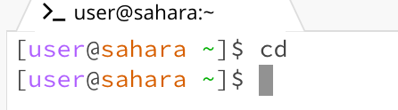
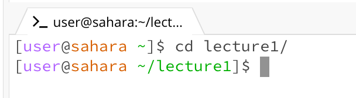
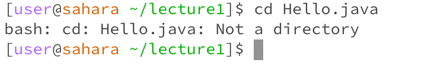
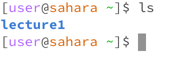
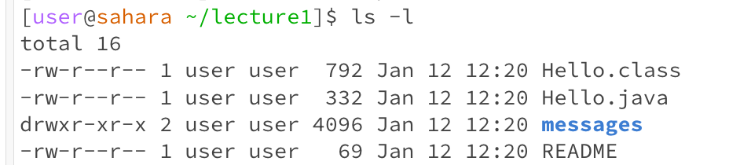
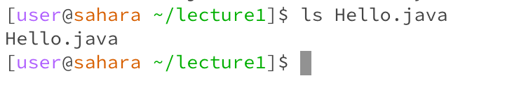
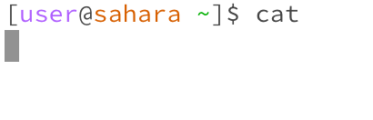
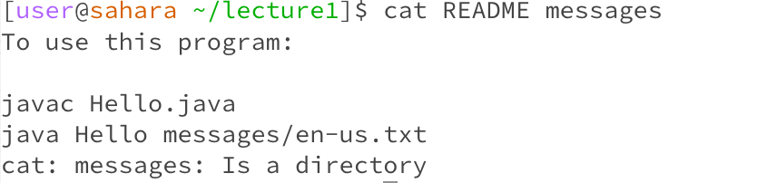
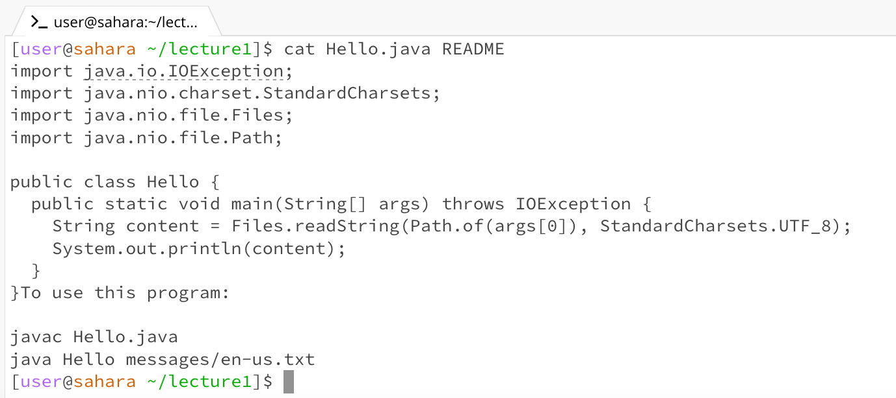

# WEEK 1 Lab Report

## cd  

**Share an example of using the command with no arguments**

**Share an example of using the command with a path to a directory as an argument**

**Share an example of using the command with a path to a file as an argument**

## ls 
**Share an example of using the command with no arguments**

**Share an example of using the command with a path to a directory as an argument**

**Share an example of using the command with a path to a file as an argument**

## cat
**Share an example of using the command with no arguments**

**Share an example of using the command with a path to a directory as an argument**

**Share an example of using the command with a path to a file as an argument**

